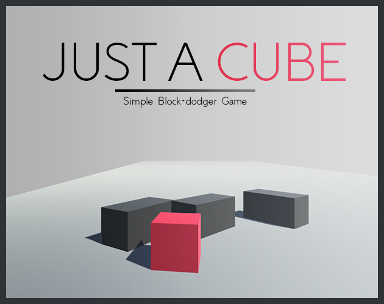

# JUST A CUBE

  

## DESCRIPTION
A 3D _hyper-casual_, endless _block-dodger_ game made by CST Games, using Unity engine.

This is a remote repository associates with "Just A Cube" project files for the Unity Editor.

## LINKS
The game currently supports _Windows_, _Linux_, and _macOS_. So if you are looking for the __latest release__ to download, check out the [___store page___](https://constance012.itch.io/just-a-cube) or the repo's [`release`](https://github.com/constance012/Just_A_Cube/releases) section for more information.

## INGAME CAPTURES

© 2022-2024 CST Games.